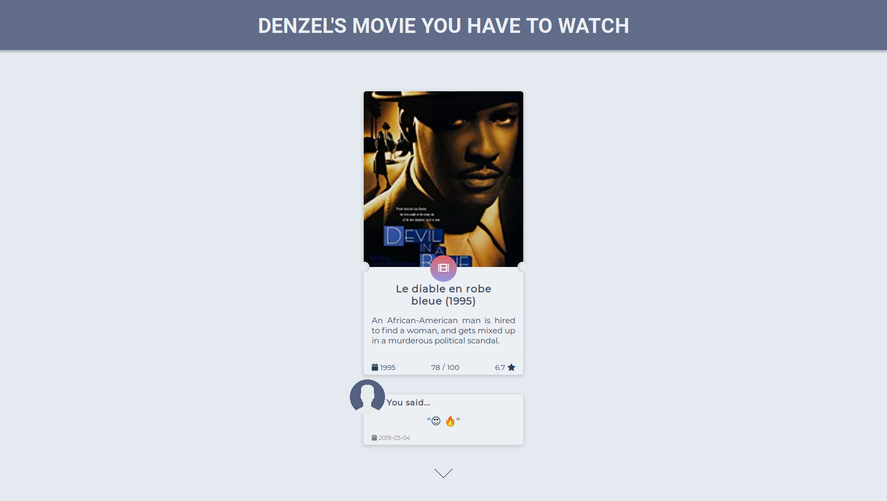

 

# Denzel Client
> Client interface for Denzel project

[VueJS](https://vuejs.org/) JavaScript Framework.  

This project is a micro-service of _Denzel_ project including the [API](https://github.com/quelhasu/denzel-movie-api).

## 💻 [Demo](https://denzel-client.netlify.com/)
You can visit this [link](https://denzel-client.netlify.com/) to seet it working.  

